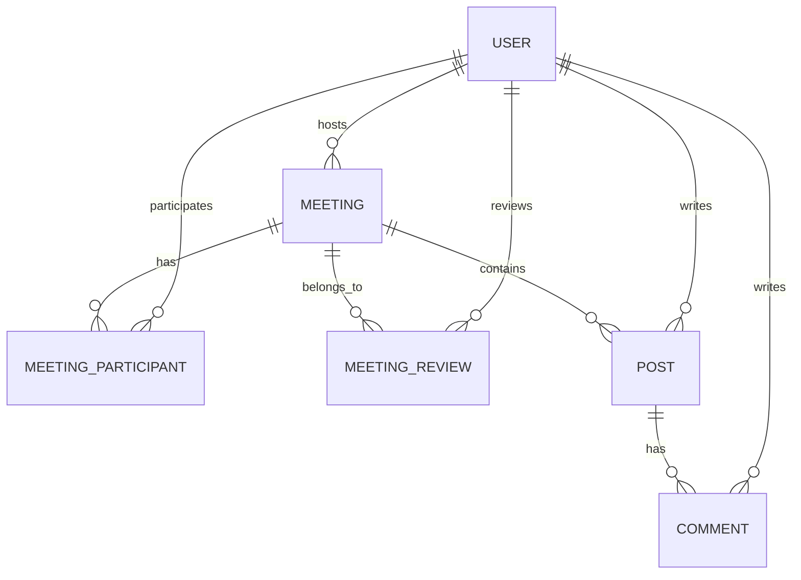

# 📚 BookJuk - 오프라인 독서모임 플랫폼

> **"책을 통해 사람과 사람이 만나고, 지식이 나누어지며, 새로운 인사이트가 탄생하는 곳"**

[](https://openjdk.java.net/)
[](https://spring.io/projects/spring-boot)
[](https://mariadb.org/)
[](https://www.thymeleaf.org/)
[](https://gradle.org/)

---

## 🎯 프로젝트 소개

**BookJuk**은 오프라인 독서모임을 쉽게 만들고 참여할 수 있는 웹 플랫폼입니다.
지역 기반 모임 매칭부터 체계적인 모임 관리, 참여자 간 소통까지 독서모임의 모든 과정을 지원합니다.

### ✨ 핵심 가치
- **연결**: 책을 매개로 한 진정한 인간관계 형성
- **성장**: 함께 읽고 토론하며 지적 성장 추구
- **신뢰**: 리뷰 시스템 기반 안전한 모임 환경
- **간편함**: 복잡한 기능 없이 핵심에만 집중

---

## 🚀 주요 기능

### 👤 사용자 관리
- **간편 회원가입/로그인** - JWT 기반 인증
- **프로필 관리** - 선호 장르, 자기소개, 프로필 이미지
- **신뢰도 시스템** - 좋아요 기반 사용자 평가

### 🏠 모임 관리
- **모임 생성/수정** - 상세 정보 입력 및 이미지 업로드
- **지역/장르별 필터링** - 맞춤형 모임 탐색
- **참가 관리** - 신청/승인/거절 시스템
- **정원 관리** - 자동 정원 체크 및 상태 관리

### 💬 소통 기능
- **모임별 게시판** - 참여자 전용 소통 공간
- **댓글 시스템** - 실시간 상호작용
- **권한 관리** - 호스트/참여자별 차등 권한

### ⭐ 리뷰 시스템
- **모임 후 좋아요** - 1회 제한, 취소 불가
- **신뢰도 축적** - 참여 이력 기반 신뢰성 평가
- **안전한 모임** - 검증된 사용자들과의 만남

---

## 🛠 기술 스택

### Backend
```
Java 17 (LTS)
Spring Boot 3.5.4
Spring Security + JWT
Spring Data JPA
QueryDSL
MariaDB 11.4.7
Gradle 8.14.3
```

### Frontend
```
HTML5 / CSS3
JavaScript ES2020+
Thymeleaf 3.1
```

### Infrastructure
```
배포 예정
```

---

## 📁 프로젝트 구조

```
BookJuk/
├── src/main/java/com/bookjuk/
│   ├── config/                 # 설정 클래스
│   ├── controller/             # REST API 컨트롤러
│   ├── domain/                 # JPA 엔티티
│   │   ├── user/              # 사용자 도메인
│   │   ├── meeting/           # 모임 도메인
│   │   ├── participant/       # 참가자 도메인
│   │   ├── board/             # 게시판 도메인
│   │   └── review/            # 리뷰 도메인
│   ├── dto/                   # 데이터 전송 객체
│   ├── exception/             # 예외 처리
│   ├── repository/            # 데이터 접근 계층
│   ├── service/               # 비즈니스 로직
│   └── jwt/                   # JWT 인증
├── src/main/resources/
│   ├── static/                # 정적 리소스 (CSS, JS, 이미지)
│   ├── templates/             # Thymeleaf 템플릿
│   └── application.yml        # 애플리케이션 설정
└── docs/                      # 프로젝트 문서
```

---

## ⚙️ 설치 및 실행

### 1. 필수 요구사항
- Java 17 이상
- MariaDB 11.4 이상
- Gradle 8.1 이상

### 2. 프로젝트 클론
```bash
git clone https://github.com/your-username/BookJuk.git
cd BookJuk
```

### 3. 데이터베이스 설정
```sql
-- MariaDB에 데이터베이스 생성
CREATE DATABASE bookjuk CHARACTER SET utf8mb4 COLLATE utf8mb4_unicode_ci;

-- 스키마 생성 (DDL 파일 실행)
mysql -u root -p bookjuk < docs/schema.sql
```

### 4. 애플리케이션 설정
```yaml
# src/main/resources/application.yml
spring:
  datasource:
    url: jdbc:mariadb://localhost:3306/bookjuk
    username: your-username
    password: your-password
  
  jpa:
    hibernate:
      ddl-auto: validate
    show-sql: true
    
jwt:
  secret: your-jwt-secret-key
  expiration: 86400000  # 24시간
```

### 5. 애플리케이션 실행
```bash
# Gradle을 사용한 실행
./gradlew bootRun

# 또는 JAR 파일 생성 후 실행
./gradlew build
java -jar build/libs/BookJuk-1.0.0.jar
```

### 6. 접속 확인
브라우저에서 `http://localhost:9000` 접속

---

## 📊 데이터베이스 설계

### ERD 다이어그램


### 주요 테이블
- **USER**: 사용자 정보 및 프로필
- **MEETING**: 독서모임 기본 정보
- **MEETING_PARTICIPANT**: 모임 참가자 관리 (N:M 해결)
- **MEETING_REVIEW**: 모임 후기 (좋아요 시스템)
- **POST**: 모임별 게시글
- **COMMENT**: 게시글 댓글

> 📋 **설계 특징**: FK 제약 조건 제거로 유연성 확보, 애플리케이션 레벨에서 무결성 보장

---

## 🔧 API 명세

### 인증 API
```http
POST   /api/users/signup      # 회원가입
POST   /api/users/login       # 로그인
GET    /api/auth/me          # 현재 사용자 정보
POST   /api/auth/logout      # 로그아웃
```

### 모임 API
```http
GET    /api/meetings                    # 모임 목록 조회
POST   /api/meetings                    # 모임 생성
GET    /api/meetings/{id}               # 모임 상세 조회
PUT    /api/meetings/{id}               # 모임 수정
POST   /api/meetings/{id}/apply         # 모임 신청
GET    /api/meetings/{id}/participants  # 참가자 목록
PATCH  /api/meetings/{id}/participants/{userId}  # 참가자 승인/거절
```

### 게시판 API
```http
GET    /api/meetings/{id}/posts              # 게시글 목록
POST   /api/meetings/{id}/posts              # 게시글 작성
GET    /api/meetings/{id}/posts/{postId}     # 게시글 상세
POST   /api/meetings/{id}/posts/{postId}/comments  # 댓글 작성
```

### 리뷰 API
```http
POST   /api/meetings/{id}/reviews        # 리뷰(좋아요) 작성
```

### 마이페이지 API
```http
GET    /api/mypage                      # 마이페이지 정보
PUT    /api/mypage/profile              # 프로필 수정
```

> 📖 **상세 API 문서**: [API 명세서](./docs/api-spec.md) 참조

---

## 🎨 화면 구성

### 📱 주요 페이지
- **메인페이지**: 모임 목록, 검색/필터링
- **모임 상세**: 모임 정보, 참가 신청, 게시판
- **모임 생성**: 모임 정보 입력 폼
- **마이페이지**: 프로필 관리, 참여 이력
- **인증페이지**: 로그인/회원가입

### 🎯 사용자 경험 특징
- **반응형 디자인**: 모바일/태블릿/데스크톱 대응
- **직관적 UI**: 간단명료한 인터페이스
- **실시간 피드백**: 즉각적인 상태 업데이트
- **접근성 고려**: 시맨틱 HTML, 키보드 네비게이션

---

## 👥 팀 구성 및 역할

### 🔐 신동준 - 사용자 인증 시스템
- JWT 기반 인증/인가
- 회원가입/로그인 API 및 UI
- 보안 정책 및 권한 관리

### 🏠 강관주 - 메인페이지 & 모임 리스트
- 모임 목록 조회 및 검색/필터링
- 메인페이지 UI/UX
- 페이지네이션 및 정렬

### ➕ 김경민 - 모임 생성
- 모임 생성 API 및 폼 UI
- 이미지 업로드 시스템
- 모임 정보 관리

### 📋 박현수 - 모임 상세 & 소통 게시판
- 모임 상세페이지 및 참가자 관리
- 게시판 시스템 (게시글/댓글)
- 권한 기반 접근 제어

### 👤 진도희 - 마이페이지
- 사용자 프로필 관리
- 참여 모임 이력 및 통계
- 좋아요 기능

---

## 📋 개발 일정

### Phase 1: 기획 & 설계 (Day 1-4)
- [x] 프로젝트 기획 및 요구사항 분석
- [x] 데이터베이스 설계 (ERD)
- [x] API 명세서 작성
- [x] UI/UX 와이어프레임

### Phase 2: 백엔드 개발 (Day 5-13)
- [x] Spring Boot 프로젝트 구성
- [x] 사용자 인증 시스템
- [x] 모임 관리 API
- [x] 게시판 시스템
- [x] 리뷰 시스템

### Phase 3: 프론트엔드 개발 (Day 9-13)
- [x] Thymeleaf 템플릿 구성
- [x] 사용자 인터페이스 구현
- [x] API 연동
- [x] 반응형 디자인

### Phase 4: 마무리 (Day 14-15)
- [x] 통합 테스트
- [x] 버그 수정 및 최적화
- [x] 배포 및 발표 준비

---

### API 테스트
- **Postman 컬렉션**: [BookJuk API Tests](./docs/postman-collection.json)
- **자동화된 테스트**: JUnit 5 + Spring Test

---

## 📈 성능 및 최적화

### 데이터베이스 최적화
- **쿼리 최적화**: QueryDSL을 활용한 동적 쿼리
- **페이지네이션**: 대용량 데이터 효율적 처리

### 애플리케이션 최적화
- **지연 로딩**: JPA 지연 로딩을 통한 성능 향상
- **캐싱**: 정적 리소스 브라우저 캐싱
- **압축**: Gzip 압축으로 전송 최적화

---

## 🔒 보안

### 인증 및 인가
- **JWT 토큰**: Stateless 인증 방식
- **권한 기반 접근 제어**: Spring Security 활용
- **비밀번호 암호화**: BCrypt 해싱

### 입력값 검증
- **서버사이드 검증**: Bean Validation 활용
- **XSS 방지**: HTML 이스케이프 처리
- **SQL Injection 방지**: PreparedStatement 사용

### 데이터 보호
- **민감정보 마스킹**: 로그에서 개인정보 제거
- **HTTPS 적용**: 프로덕션 환경 암호화 통신
- **환경변수 관리**: 설정 정보 외부화

---

## 📚 문서화

### 프로젝트 문서
- [📋 요구사항 명세서](./docs/requirements.md)
- [🗄️ ERD 설계서](./docs/erd.md)
- [📑 API 명세서](./docs/api-spec.md)
- [🚨 에러 처리 가이드](./docs/error_handling.md)
- [📁 폴더 구조](./docs/folder_structure.md)
- [🤝 협업 규칙](./docs/collaboration-rules.md)
- [📅 개발 로드맵](./docs/roadmap.md)
- [🎯 프로젝트 개요](./docs/project_overview.md)

### 기술 문서
- [🗄️ 데이터베이스 스키마](./docs/schema.md)
- [📊 DBML ERD](./docs/bookjuk.dbml)

---

## 🚀 배포

### 로컬 개발 환경
```bash
예정 
```

---

## 🤝 기여하기

### 개발 환경 설정
1. Repository Fork 및 Clone
2. 로컬 개발 환경 구성
3. 기능 브랜치 생성 (`feature/new-feature`)
4. 개발 및 테스트
5. Pull Request 생성

### 코딩 컨벤션
- **Java**: Google Java Style Guide
- **Git 커밋**: Conventional Commits
- **브랜치**: Git Flow 전략

### 코드 리뷰
- 모든 PR은 1명 이상 리뷰 후 머지
- 테스트 코드 작성 필수
- 문서 업데이트 동반

---

## 📄 라이센스

이 프로젝트는 [MIT License](./LICENSE)를 따릅니다.

---

## 🎯 향후 계획

### Phase 2: 모바일 최적화 (v2.0)
- [ ] React Native 모바일 앱
- [ ] 푸시 알림 시스템
- [ ] 오프라인 모드 지원

### Phase 3: 고도화 (v3.0)
- [ ] 실시간 채팅 시스템
- [ ] AI 기반 도서 추천
- [ ] 소셜 로그인 연동
- [ ] 결제 시스템 통합

### Phase 4: 확장 (v4.0)
- [ ] 관리자 대시보드
- [ ] 상세 통계 및 분석
- [ ] 다국어 지원
- [ ] 기업용 서비스

---

## 🙏 감사의 말

BookJuk 프로젝트를 만들어가는 모든 분들께 감사드립니다.

### 팀원들
- **신동준** - 백엔드 인증 시스템 및 보안
- **강관주** - 메인페이지 및 모임 탐색 기능
- **김경민** - 모임 생성 및 관리 시스템
- **박현수** - 모임 상세 및 소통 게시판
- **진도희** - 마이페이지 및 사용자 경험

### 사용된 오픈소스
- [Spring Boot](https://spring.io/projects/spring-boot)
- [Thymeleaf](https://www.thymeleaf.org/)
- [MariaDB](https://mariadb.org/)
- [QueryDSL](http://www.querydsl.com/)

---

## 🧾 팀원별 오늘의 회고

> 아래 링크를 통해 각자의 회고 문서를 볼 수 있습니다.

* [강관주 - 2025-08-13 회고](https://github.com/Kanggwanju/project-docs/blob/main/meeting-notes)
* [김경민 - 2025-08-13 회고](https://github.com/minee0505/meetings/blob/main)
* [박현수 - 2025-08-13 회고](https://github.com/hsp64/memoir/blob/main/teamNextPage20250805)
* [신동준 - 2025-08-13 회고](https://github.com/sdj3959/my-retrospectives/tree/master/projects/202508BookJuk)
* [진도희 - 2025-08-13 회고]([https://github.com/dohee-jin/project/blob/main/bookjuk/docs/meetings](https://github.com/dohee-jin/project/blob/bookjuk/bookjuk/docs/retrospectives/bookjuck-retrospectives.md))

---

**BookJuk** - *책을 통해 연결되는 세상*

