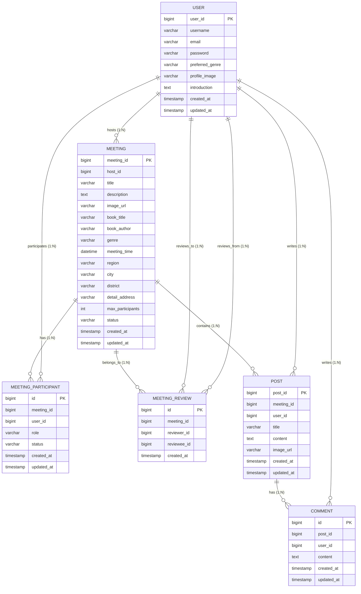

# 🗄️ BookJuk ERD (Entity Relationship Diagram)

| 문서 버전 | 작성일        | 수정일        | 작성자         | 비고                       |
|:------| :--------- | :--------- | :---------- |:-------------------------|
| v1.6  | 2025-08-18 | 2025-08-19 | hsp64  | FK 제약 조건 제거, 실제 ddl파일 기반 |

---

## 📋 목차

1. [개요](#1-개요)
2. [ERD 다이어그램](#2-erd-다이어그램)
3. [테이블 상세 정보](#3-테이블-상세-정보)
4. [관계 설명](#4-관계-설명)
5. [비즈니스 규칙](#5-비즈니스-규칙)
6. [인덱스 전략](#6-인덱스-전략)

---

## 1. 개요

BookJuk 데이터베이스는 **오프라인 독서모임 플랫폼**을 위한 6개의 핵심 테이블로 구성되어 있습니다.

### 🎯 **설계 원칙**
- **FK/UNIQUE 제약 조건 제거**: 애플리케이션 레벨에서 무결성 보장
- **도메인 중심 설계**: 사용자, 모임, 게시판, 리뷰 도메인 분리
- **확장성 고려**: 향후 기능 추가를 위한 유연한 구조

---

## 2. ERD 다이어그램

### 2.1 Mermaid ERD



### 2.2 텍스트 기반 관계도

```
📚 BookJuk 데이터베이스 관계도

👤 USER (사용자)
├── 🏠 MEETING (1:N) - 모임 호스팅
├── 🤝 MEETING_PARTICIPANT (1:N) - 모임 참여
├── ⭐ MEETING_REVIEW (1:N) - 리뷰 작성 (reviewer)
├── ⭐ MEETING_REVIEW (1:N) - 리뷰 받기 (reviewee)
├── 📝 POST (1:N) - 게시글 작성
└── 💬 COMMENT (1:N) - 댓글 작성

🏠 MEETING (모임)
├── 👤 USER (N:1) - 호스트
├── 🤝 MEETING_PARTICIPANT (1:N) - 참가자들
├── ⭐ MEETING_REVIEW (1:N) - 모임 리뷰들
└── 📝 POST (1:N) - 모임 게시글들

📝 POST (게시글)
├── 🏠 MEETING (N:1) - 소속 모임
├── 👤 USER (N:1) - 작성자
└── 💬 COMMENT (1:N) - 댓글들

💬 COMMENT (댓글)
├── 📝 POST (N:1) - 원본 게시글
└── 👤 USER (N:1) - 작성자
```

---

## 3. 테이블 상세 정보

### 3.1 USER (사용자)

| 컬럼명 | 타입 | 제약조건 | 설명 |
|--------|------|----------|------|
| `user_id` | BIGINT | PK, AUTO_INCREMENT | 사용자 고유 식별자 |
| `username` | VARCHAR(50) | NOT NULL | 닉네임 (중복 허용) |
| `email` | VARCHAR(100) | NOT NULL | 이메일 (로그인 ID) |
| `password` | VARCHAR(255) | NOT NULL | 암호화된 비밀번호 |
| `preferred_genre` | VARCHAR(100) | NULL | 선호 장르 |
| `profile_image` | VARCHAR(255) | NULL, DEFAULT 'default_profile.jpg' | 프로필 이미지 URL |
| `introduction` | TEXT | NULL | 자기소개 |
| `created_at` | TIMESTAMP | NOT NULL, DEFAULT CURRENT_TIMESTAMP | 가입일 |
| `updated_at` | TIMESTAMP | NOT NULL, DEFAULT CURRENT_TIMESTAMP ON UPDATE | 수정일 |

**인덱스**: `idx_user_email` ON (`email`)

### 3.2 MEETING (모임)

| 컬럼명 | 타입 | 제약조건 | 설명 |
|--------|------|----------|------|
| `meeting_id` | BIGINT | PK, AUTO_INCREMENT | 모임 고유 식별자 |
| `host_id` | BIGINT | NOT NULL | 호스트 사용자 ID (USER 테이블 참조) |
| `title` | VARCHAR(255) | NOT NULL | 모임 제목 |
| `description` | TEXT | NULL | 모임 상세 설명 |
| `image_url` | VARCHAR(255) | NULL | 대표 이미지 URL |
| `book_title` | VARCHAR(255) | NOT NULL | 선정 도서 제목 |
| `book_author` | VARCHAR(100) | NOT NULL | 선정 도서 저자 |
| `genre` | VARCHAR(100) | NOT NULL | 모임 장르 |
| `meeting_time` | DATETIME | NOT NULL | 모임 시간 |
| `region` | VARCHAR(20) | NOT NULL | 시/도 |
| `city` | VARCHAR(30) | NOT NULL | 시/군 |
| `district` | VARCHAR(30) | NOT NULL | 구/군 |
| `detail_address` | VARCHAR(255) | NULL | 상세주소 |
| `max_participants` | INT | NOT NULL | 최대 참여 인원 |
| `status` | VARCHAR(20) | NOT NULL, DEFAULT 'RECRUITING' | 모임 상태 |
| `created_at` | TIMESTAMP | NOT NULL, DEFAULT CURRENT_TIMESTAMP | 생성일 |
| `updated_at` | TIMESTAMP | NOT NULL, DEFAULT CURRENT_TIMESTAMP ON UPDATE | 수정일 |

**상태값**: `RECRUITING`, `FULL`, `COMPLETED`, `CANCELLED`  
**인덱스**: `idx_meeting_host` ON (`host_id`)  
**참조 관계**: `host_id`는 USER 테이블의 `user_id`를 논리적으로 참조

### 3.3 MEETING_PARTICIPANT (모임 참가자)

| 컬럼명 | 타입 | 제약조건 | 설명 |
|--------|------|----------|------|
| `id` | BIGINT | PK, AUTO_INCREMENT | 참여 고유 식별자 |
| `meeting_id` | BIGINT | NOT NULL | 모임 ID (MEETING 테이블 참조) |
| `user_id` | BIGINT | NOT NULL | 사용자 ID (USER 테이블 참조) |
| `role` | VARCHAR(20) | NOT NULL | 역할 (HOST, PARTICIPANT) |
| `status` | VARCHAR(20) | NOT NULL, DEFAULT 'PENDING' | 참여 상태 |
| `created_at` | TIMESTAMP | NOT NULL, DEFAULT CURRENT_TIMESTAMP | 신청일 |
| `updated_at` | TIMESTAMP | NOT NULL, DEFAULT CURRENT_TIMESTAMP ON UPDATE | 상태 변경일 |

**역할값**: `HOST`, `PARTICIPANT`  
**상태값**: `PENDING`, `APPROVED`, `REJECTED`  
**인덱스**: `idx_mp_meeting_user_status` ON (`meeting_id`, `user_id`, `status`)  
**참조 관계**:
- `meeting_id`는 MEETING 테이블의 `meeting_id`를 논리적으로 참조
- `user_id`는 USER 테이블의 `user_id`를 논리적으로 참조

### 3.4 MEETING_REVIEW (모임 리뷰)

| 컬럼명 | 타입 | 제약조건 | 설명 |
|--------|------|----------|------|
| `id` | BIGINT | PK, AUTO_INCREMENT | 리뷰 고유 식별자 |
| `meeting_id` | BIGINT | NOT NULL | 모임 ID (MEETING 테이블 참조) |
| `reviewer_id` | BIGINT | NOT NULL | 리뷰 작성자 ID (USER 테이블 참조) |
| `reviewee_id` | BIGINT | NOT NULL | 리뷰 받는 사용자 ID (USER 테이블 참조) |
| `created_at` | TIMESTAMP | NOT NULL, DEFAULT CURRENT_TIMESTAMP | 리뷰 작성일 |

**참조 관계**:
- `meeting_id`는 MEETING 테이블의 `meeting_id`를 논리적으로 참조
- `reviewer_id`는 USER 테이블의 `user_id`를 논리적으로 참조
- `reviewee_id`는 USER 테이블의 `user_id`를 논리적으로 참조

### 3.5 POST (게시글)

| 컬럼명 | 타입 | 제약조건 | 설명 |
|--------|------|----------|------|
| `post_id` | BIGINT | PK, AUTO_INCREMENT | 게시글 고유 식별자 |
| `meeting_id` | BIGINT | NOT NULL | 소속 모임 ID (MEETING 테이블 참조) |
| `user_id` | BIGINT | NOT NULL | 작성자 ID (USER 테이블 참조) |
| `title` | VARCHAR(200) | NOT NULL | 게시글 제목 |
| `content` | TEXT | NOT NULL | 게시글 내용 |
| `image_url` | VARCHAR(255) | NULL | 첨부 이미지 URL |
| `created_at` | TIMESTAMP | NOT NULL, DEFAULT CURRENT_TIMESTAMP | 작성일 |
| `updated_at` | TIMESTAMP | NOT NULL, DEFAULT CURRENT_TIMESTAMP ON UPDATE | 수정일 |

**인덱스**: `idx_post_meeting_created` ON (`meeting_id`, `created_at`)  
**참조 관계**:
- `meeting_id`는 MEETING 테이블의 `meeting_id`를 논리적으로 참조
- `user_id`는 USER 테이블의 `user_id`를 논리적으로 참조

### 3.6 COMMENT (댓글)

| 컬럼명 | 타입 | 제약조건 | 설명 |
|--------|------|----------|------|
| `id` | BIGINT | PK, AUTO_INCREMENT | 댓글 고유 식별자 |
| `post_id` | BIGINT | NOT NULL | 원본 게시글 ID (POST 테이블 참조) |
| `user_id` | BIGINT | NOT NULL | 작성자 ID (USER 테이블 참조) |
| `content` | TEXT | NOT NULL | 댓글 내용 |
| `created_at` | TIMESTAMP | NOT NULL, DEFAULT CURRENT_TIMESTAMP | 작성일 |
| `updated_at` | TIMESTAMP | NOT NULL, DEFAULT CURRENT_TIMESTAMP ON UPDATE | 수정일 |

**인덱스**: `idx_comment_post_created` ON (`post_id`, `created_at`)  
**참조 관계**:
- `post_id`는 POST 테이블의 `post_id`를 논리적으로 참조
- `user_id`는 USER 테이블의 `user_id`를 논리적으로 참조

---

## 4. 관계 설명

> **주의**: 모든 관계는 **논리적 관계**로, 데이터베이스 레벨의 외래 키 제약 조건은 없습니다.  
> 데이터 무결성은 **애플리케이션 레벨**에서 보장해야 합니다.

### 4.1 User ↔ Meeting 관계

#### **1:N 호스팅 관계**
- 한 사용자는 여러 모임을 호스팅할 수 있음
- 한 모임은 하나의 호스트만 가짐
- `meeting.host_id` → `user.user_id` (논리적 참조)

#### **N:M 참여 관계 (through MEETING_PARTICIPANT)**
- 한 사용자는 여러 모임에 참여할 수 있음
- 한 모임은 여러 참여자를 가질 수 있음
- 중간 테이블을 통한 다대다 관계 해결

### 4.2 Meeting ↔ Post ↔ Comment 관계

#### **계층적 구조**
```
Meeting (모임)
└── Post (게시글)
    └── Comment (댓글)
```

- **Meeting → Post**: 1:N (한 모임은 여러 게시글)
- **Post → Comment**: 1:N (한 게시글은 여러 댓글)
- **User와의 관계**: 모든 컨텐츠는 작성자 정보 보유

### 4.3 Review 관계

#### **3원 관계 (Ternary Relationship)**
- **Meeting**: 어떤 모임에서 발생한 리뷰인가?
- **Reviewer**: 누가 리뷰를 작성했는가?
- **Reviewee**: 누가 리뷰를 받았는가?

---

## 5. 비즈니스 규칙

> **중요**: 모든 비즈니스 규칙은 **애플리케이션 레벨**에서 구현되어야 합니다.

### 5.1 사용자 관련 규칙

- ✅ **이메일 중복 불가**: 애플리케이션에서 검증 (DB 제약 없음)
- ✅ **닉네임 중복 허용**: 같은 닉네임 사용 가능
- ✅ **프로필 이미지 기본값**: `default_profile.jpg`

### 5.2 모임 관련 규칙

- ✅ **호스트 존재 검증**: `host_id`가 유효한 사용자인지 애플리케이션에서 확인
- ✅ **호스트 자동 참가**: 모임 생성 시 호스트는 자동으로 APPROVED 상태로 참가
- ✅ **정원 제한**: `max_participants` 초과 불가 (애플리케이션 검증)
- ✅ **상태 전이**:
  ```
  RECRUITING → FULL (정원 마감)
  RECRUITING → COMPLETED (모임 종료)
  RECRUITING → CANCELLED (모임 취소)
  ```

### 5.3 참가자 관리 규칙

- ✅ **참조 무결성**: `meeting_id`, `user_id`가 존재하는지 애플리케이션에서 확인
- ✅ **중복 신청 방지**: 같은 사용자가 같은 모임에 여러 번 신청 불가
- ✅ **상태 전이**:
  ```
  PENDING → APPROVED (승인)
  PENDING → REJECTED (거절)
  ```
- ✅ **호스트 권한**: 호스트만 참가자 승인/거절 가능

### 5.4 게시판 접근 규칙

- ✅ **참조 무결성**: `meeting_id`, `user_id`가 존재하는지 애플리케이션에서 확인
- ✅ **작성 권한**: HOST 또는 APPROVED 상태의 PARTICIPANT만 가능
- ✅ **읽기 권한**: 모든 사용자 가능
- ✅ **수정/삭제 권한**: 작성자 또는 호스트만 가능

### 5.5 리뷰 규칙

- ✅ **참조 무결성**: `meeting_id`, `reviewer_id`, `reviewee_id`가 존재하는지 확인
- ✅ **모임 완료 후에만**: 상태가 COMPLETED인 모임에서만 가능
- ✅ **1회 제한**: 같은 모임에서 같은 대상에게 1번만 리뷰 가능
- ✅ **자기 자신 제외**: 본인에게는 리뷰 불가 (`reviewer_id ≠ reviewee_id`)
- ✅ **참여자만**: 해당 모임에 참여한 사용자만 리뷰 가능

### 5.6 댓글 규칙

- ✅ **참조 무결성**: `post_id`, `user_id`가 존재하는지 애플리케이션에서 확인
- ✅ **작성 권한**: 해당 모임의 참여자만 댓글 작성 가능
- ✅ **수정/삭제 권한**: 댓글 작성자 또는 게시글 작성자, 모임 호스트만 가능

---

## 6. 인덱스 전략

### 6.1 검색 최적화 인덱스

```
-- 사용자 이메일 검색 (로그인)
CREATE INDEX idx_user_email ON user(email);

-- 모임 호스트 검색
CREATE INDEX idx_meeting_host ON meeting(host_id);

-- 참가자 검색 (모임별, 사용자별, 상태별)
CREATE INDEX idx_mp_meeting_user_status ON meeting_participant(meeting_id, user_id, status);

-- 게시글 검색 (모임별, 최신순)
CREATE INDEX idx_post_meeting_created ON post(meeting_id, created_at);

-- 댓글 검색 (게시글별, 최신순)
CREATE INDEX idx_comment_post_created ON comment(post_id, created_at);
```

### 6.2 추가 고려사항

```
-- 리뷰 검색을 위한 복합 인덱스 (선택사항)
CREATE INDEX idx_review_meeting_reviewer ON meeting_review(meeting_id, reviewer_id);
CREATE INDEX idx_review_reviewee ON meeting_review(reviewee_id);

-- 모임 검색을 위한 복합 인덱스 (선택사항)
CREATE INDEX idx_meeting_location_status ON meeting(region, city, status);
CREATE INDEX idx_meeting_genre_time ON meeting(genre, meeting_time);
```

### 6.3 인덱스 활용 쿼리 예시

```
-- 모임 목록 조회 (지역별, 장르별 필터)
SELECT * FROM meeting 
WHERE region = '서울특별시' 
  AND city = '강남구' 
  AND genre = '소설'
  AND status = 'RECRUITING'
ORDER BY created_at DESC;

-- 특정 모임의 승인된 참가자 목록 (JOIN 시 애플리케이션에서 데이터 존재 확인 필요)
SELECT u.* FROM user u
JOIN meeting_participant mp ON u.user_id = mp.user_id
WHERE mp.meeting_id = 1 AND mp.status = 'APPROVED'
ORDER BY mp.created_at;

-- 모임별 게시글 목록 (최신순)
SELECT * FROM post 
WHERE meeting_id = 1 
ORDER BY created_at DESC 
LIMIT 10 OFFSET 0;
```

---

## 📝 **설계 고려사항**

### ✅ **장점**

1. **유연한 무결성 관리**: 애플리케이션에서 비즈니스 로직에 따른 세밀한 제어
2. **확장성**: 새로운 관계나 필드 추가 시 제약 조건 충돌 없음
3. **성능**: 외래 키 제약 조건 검사 오버헤드 없음
4. **도메인 분리**: 명확한 도메인별 테이블 구조
5. **유연한 삭제**: 참조 관계에 구애받지 않는 데이터 삭제 가능

### ⚠️ **주의사항**

1. **데이터 정합성**: 애플리케이션에서 모든 참조 무결성 검증 필수
2. **트랜잭션 관리**: 관련 데이터 변경 시 원자성 보장 중요
3. **중복 데이터 방지**: 애플리케이션에서 중복 검사 로직 철저히 구현
4. **고아 데이터 관리**: 참조되지 않는 데이터에 대한 정기적 정리 필요
5. **개발자 실수**: DB 레벨 제약이 없어 실수에 따른 데이터 불일치 위험

### 🔧 **애플리케이션에서 구현해야 할 필수 사항**

1. **참조 무결성 검증**
   ```
   // 예시: 모임 생성 시 호스트 존재 확인
   if (!userRepository.existsById(hostId)) {
       throw new IllegalArgumentException("존재하지 않는 호스트입니다.");
   }
   ```

2. **트랜잭션 관리**
   ```java
   @Transactional
   public void createMeetingWithHost(Meeting meeting) {
       // 1. 모임 생성
       meetingRepository.save(meeting);
       // 2. 호스트를 참가자로 등록
       participantRepository.save(new MeetingParticipant(meeting.getId(), meeting.getHostId(), "HOST", "APPROVED"));
   }
   ```

3. **중복 검사**
   ```
   // 예시: 중복 참가 신청 방지
   if (participantRepository.existsByMeetingIdAndUserId(meetingId, userId)) {
       throw new DuplicateParticipationException("이미 신청한 모임입니다.");
   }
   ```

### 🔮 **향후 확장 계획**

1. **알림 시스템**: `notification` 테이블 추가
2. **파일 관리**: `file_upload` 테이블 추가
3. **모임 카테고리**: `category` 테이블 추가
4. **사용자 관계**: `user_follow` 테이블 추가 (팔로우 기능)
5. **북마크**: `meeting_bookmark` 테이블 추가
6. **모임 평가**: `meeting_rating` 테이블 추가 (별점 시스템)

---

## 🚨 **개발 시 체크리스트**

### **데이터 생성 시**
- [ ] 참조하는 ID가 실제로 존재하는가?
- [ ] 비즈니스 규칙을 위반하지 않는가?
- [ ] 트랜잭션 범위가 적절한가?

### **데이터 수정 시**
- [ ] 연관된 데이터의 일관성이 유지되는가?
- [ ] 상태 변경이 올바른 순서로 진행되는가?

### **데이터 삭제 시**
- [ ] 연관 데이터 처리 방식이 명확한가? (삭제/유지)
- [ ] 고아 데이터가 발생하지 않는가?

### **쿼리 실행 시**
- [ ] JOIN 시 연관 데이터가 존재함을 가정하지 않는가?
- [ ] NULL 처리가 적절한가?